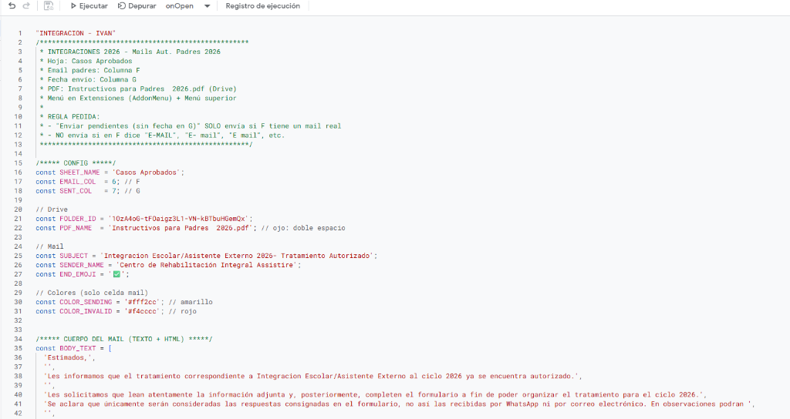
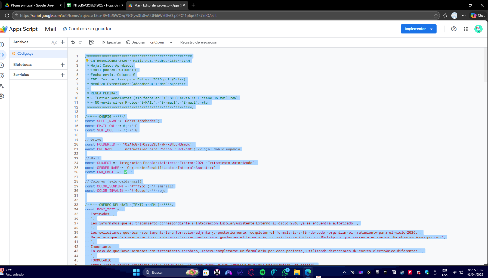

<div align="center">

# 🏫 Sistema de Notificaciones — Integración Escolar 2026

### Automatización de comunicación con familias de pacientes con tratamiento de IE autorizado

[](https://script.google.com)
[](https://sheets.google.com)
[](https://developers.google.com/apps-script/reference/gmail)
[](https://developers.google.com/apps-script/reference/drive)

<br/>

> **Assistire — Centro de Rehabilitación Integral**
>
> Script que automatiza el envío de emails a padres de pacientes con tratamiento de **Integración Escolar / Asistente Externo 2026** autorizado, adjuntando el instructivo oficial en PDF desde Google Drive. Incluye validación robusta de emails y registro automático de envíos.

</div>

---

## 📸 Screenshots

<table>
  <tr>
    <td align="center"><b>🏫 Script — Integración Escolar (código fuente)</b></td>
    <td align="center"><b>💻 Editor Apps Script — Vista completa</b></td>
  </tr>
  <tr>
    <td></td>
    <td></td>
  </tr>
</table>

---

## ⚡ El problema que resuelve

Notificar manualmente a decenas de familias sobre la autorización del tratamiento de Integración Escolar es tedioso y propenso a errores (emails mal escritos en la hoja, reenvíos duplicados). Este script automatiza el proceso completo con validación y registro.

---

## 🚀 Funcionalidades

| Feature | Descripción |
|---|---|
| 📧 **Envío individual o masivo** | Procesa la fila seleccionada o todos los pendientes sin fecha de envío |
| 🛡️ **Validación robusta de emails** | Descarta placeholders: `"E-MAIL"`, `"E mail"`, `"E_mail"`, campos vacíos |
| 📎 **PDF institucional adjunto** | Adjunta `Instructivos para Padres 2026.pdf` desde Google Drive con fallback por espacios |
| 📋 **Doble menú de acceso** | Disponible desde **Extensiones** y desde la barra superior de Google Sheets |
| 🎨 **Indicadores visuales** | 🟡 amarillo durante envío · 🔴 rojo si email inválido |
| 📅 **Registro de fecha** | Columna G registra timestamp automático al enviar — evita duplicados |
| 🔔 **Trigger `onOpen`** | Menú se activa automáticamente al abrir el documento |

---

## 🔁 Flujo del sistema

```
Hoja "Casos Aprobados"
        │
        ▼
Leer fila(s) pendientes  ←  Sin fecha en columna G
        │
        ▼
Validar email en columna F
        │
        ├─ Email inválido  →  Colorear celda 🔴 + log en consola
        │
        └─ Email válido    →  Colorear celda 🟡 (enviando)
                │
                ▼
        Adjuntar PDF desde Google Drive
                │
                ▼
        GmailApp.sendEmail()
        Asunto: "Integracion Escolar/Asistente Externo 2026 - Tratamiento Autorizado"
                │
                ▼
        Registrar fecha en columna G  ✅
        Colorear celda verde  ✅
```

---

## ⚙️ Archivos del proyecto

| Archivo | Función |
|---|---|
| `Code Integracion.txt` | Script completo: validación, envío de emails, menú y triggers |

---

## 🛠️ Stack técnico

| Tecnología | Uso |
|---|---|
| **Google Apps Script** | Runtime serverless |
| **GmailApp** | Envío de emails HTML a las familias |
| **DriveApp** | Búsqueda y adjunto del PDF institucional desde Drive |
| **Google Sheets API** | Lectura de datos y escritura de estado por celda |
| **ScriptApp Triggers** | `onOpen` para activar menú al abrir la hoja |

---

## 🔧 Configuración

```javascript
// Parámetros principales
const SHEET_NAME = 'Casos Aprobados';
const EMAIL_COL  = 6;   // F — Email del padre/madre
const SENT_COL   = 7;   // G — Fecha de envío (evita duplicados)

// Google Drive — PDF a adjuntar
const FOLDER_ID  = 'TU_FOLDER_ID_DE_DRIVE';
const PDF_NAME   = 'Instructivos para Padres  2026.pdf';  // ojo: doble espacio

// Email
const SUBJECT    = 'Integracion Escolar/Asistente Externo 2026- Tratamiento Autorizado';
const SENDER_NAME = 'Centro de Rehabilitación Integral Assistire';

// Colores de estado
const COLOR_SENDING = '#fff2cc';  // 🟡 amarillo
const COLOR_INVALID = '#f4cccc';  // 🔴 rojo
```

---

## 📧 Cuerpo del email (estructura)

```
Estimados,

Les informamos que el tratamiento de Integración Escolar/Asistente Externo
al ciclo 2026 ya se encuentra autorizado.

Les solicitamos que lean el instructivo adjunto y completen el formulario
para organizar el tratamiento para el ciclo 2026.

[PDF adjunto: Instructivos para Padres 2026.pdf]
```

---

## 👤 Autor

**Iván De la Torre** — Data Quality & Web Developer · Buenos Aires, Argentina

[](https://ivan-de-la-torre-portfolio.vercel.app)
[](https://github.com/Delatorreivan1998)
